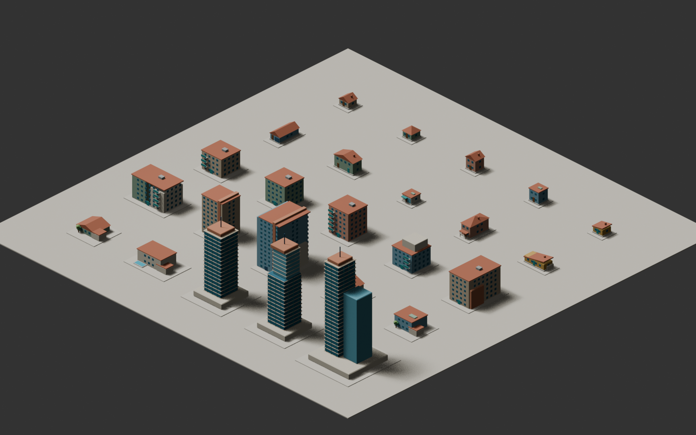
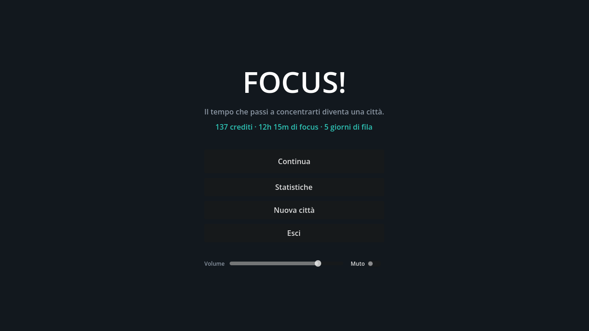
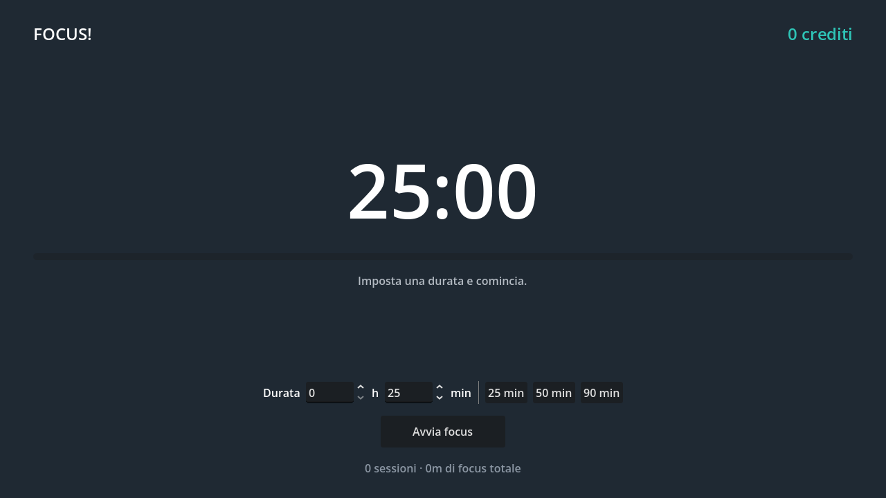
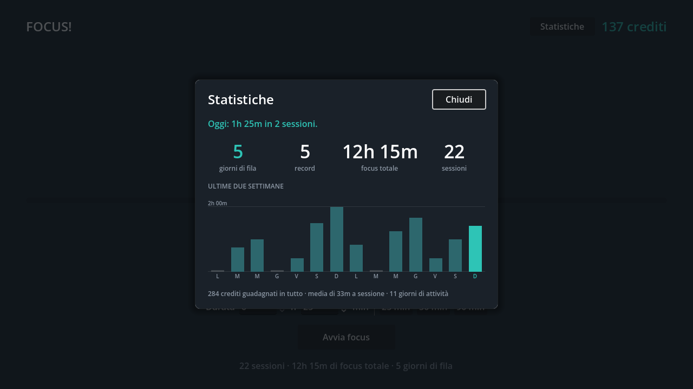
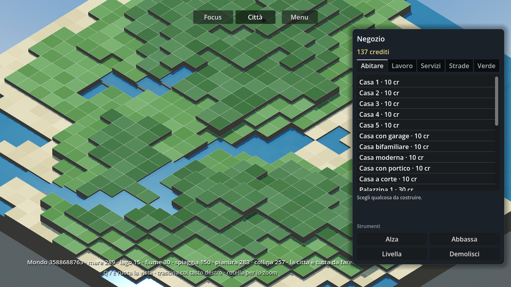
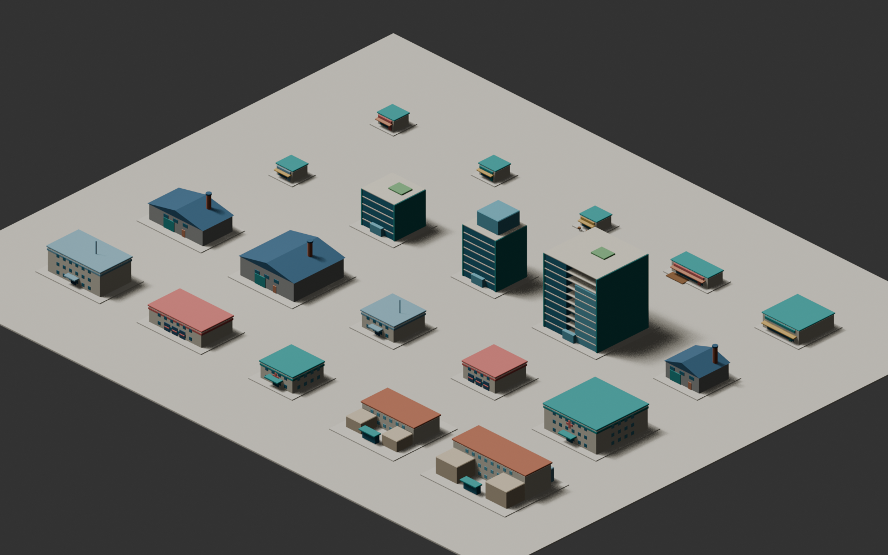

<div align="center">

# FOCUS!

**Il tempo che passi a concentrarti diventa una città.**

Imposti un timer, lavori o studi per davvero, e ogni minuto di concentrazione
si trasforma in crediti da spendere per tirare su, pezzo dopo pezzo, una città
3D isometrica.




</div>

---

> [!NOTE]
> **Le cinque fasi sono chiuse.** Il giro è completo e rifinito: fai focus,
> guadagni crediti, apri il negozio, costruisci, modelli il terreno, e le
> giornate di concentrazione si accumulano in una serie che puoi guardare
> crescere. La roadmap qui sotto dice cosa c'è dentro ogni fase.

## L'idea

Le app di produttività ti danno una spunta e una statistica. Qui la ricompensa
è qualcosa che **resta e si vede crescere**: un'ora di concentrazione vale dieci
crediti, dieci crediti valgono un quartiere in più.

```
┌─────────────────┐     crediti     ┌─────────────────┐
│  MODALITÀ FOCUS │ ──────────────► │  MODALITÀ CITTÀ │
│  (timer, UI 2D) │                 │  (mondo 3D)     │
└─────────────────┘                 └─────────────────┘
         │                                   │
         └──────────► SaveManager ◄──────────┘
              (crediti, mondo, statistiche)
```

Nessun blocco dei siti, nessun controllo, nessuna penalità: il timer va **a
fiducia**. L'unica persona che imbrogli sei tu.

## Com'è adesso



Si parte da qui: la partita in una riga — crediti, ore di focus, giorni di fila
— e da qui si continua, si ricomincia da un mondo nuovo, o si regola il volume.
L'Esc apre e chiude il menu da qualunque schermata.



Durata libera in ore e minuti, preset rapidi, pausa e ripresa, crediti e
statistiche sempre a schermo. Quando il timer finisce suona una campana e la
finestra chiede attenzione nella barra delle applicazioni: un timer di
concentrazione si usa guardando altrove.



Giorni di fila, record, ore totali, sessioni, e le ultime due settimane una
colonna al giorno — i giorni vuoti compresi, perché è il buco a raccontare la
storia. La serie regge fino a mezzanotte: se oggi non hai ancora cominciato si
conta da ieri, che la giornata non è finita.



Il mondo su griglia da 2 metri, generato da un seme: heightmap a gradini, mare,
laghi, fiumi che scendono dalle alture, spiagge, pianure e colline. La camera
ortografica ruota a scatti di 90° sui quattro lati. Del terreno non si salva
niente se non il seme — si rigenera identico. Il timer continua a scorrere
mentre sei qui.

Il negozio ha cinque scaffali e i prezzi in chiaro; quello che non ti puoi
ancora permettere resta a schermo, spento, perché sapere quanto manca è metà del
motivo per tornare a fare focus. Scegli, e l'oggetto ti segue col mouse: verde
se il posto va bene, rosso se no, con i riquadri già alla quota a cui il lotto
verrà spianato. `R` lo gira, un clic lo posa e scala i crediti. Demolire ne
restituisce la metà; il lotto invece resta spianato, perché sbancare è una
modifica al mondo e non un pezzo dell'edificio.

**I ponti hanno una regola loro.** Una campata va solo sull'acqua e solo
attaccata a una riva o a un'altra campata, e sta un gradino sopra la sponda —
esattamente il dislivello che le rampe del kit colmano. La pila sotto non si
compra: nasce da sola, scegliendo l'altezza sulla luce da coprire. E le rampe
ne hanno una loro: vogliono il piede in piano e un gradino solo da salire,
terreno o impalcato che sia, quindi la campata si posa prima delle sue rampe.

**E poi c'è il badile.** Alza, abbassa e livella spostano il suolo di mezzo
metro per volta, a un credito a gradino e senza rimborso. Sotto una costruzione
il terreno non si tocca — demolisci prima — e fra due celle vicine il salto non
può superare i quattro gradini. Il resto lo decide l'acqua da sola: scava una
conca abbastanza a fondo e ci trovi un lago, collegalo alla costa con un canale
e diventa mare, alza un fondale e ti resta un'isola.

**E si sente.** Nove effetti — avvio, pausa, la campana di fine, i crediti, il
tonfo di una posa, il crollo di una demolizione, la palata del badile, il no di
un rifiuto, il clic di un pulsante — e nessun file audio nel repository:
nascono all'avvio da una tabella di note, come i modelli nascono da uno script
Blender. Il volume sta nel menu.

## Il kit di asset

91 modelli low-poly, nessuno modellato a mano: sono tutti **generati da script
Python in Blender**, con una direzione visiva condivisa chiamata *Focus Grove* —
volumi morbidi, materiali flat, pareti calde, tetti in terracotta, accenti teal.

|  | Contenuto |
|---|---|
| **Residenziale** | 10 case, 6 condomini, 2 palazzoni, 4 ville, 3 torri |
| **Urbano** | 6 negozi, 3 uffici, 3 fabbriche, 4 parchi, scuole, polizia, vigili del fuoco, sanità |
| **Infrastrutture** | 10 moduli di strada, 8 rampe, 7 pezzi di ponte con le loro pile, eolico, torre idrica, solare, campi sportivi, fienile e serre |
| **Natura** | 6 alberi riutilizzabili |

<div align="center">



</div>

Il generatore è **deterministico**: stesso ID e stesso seed producono sempre lo
stesso modello. Cambi un parametro di stile e rigeneri tutta la libreria in un
colpo solo.

```powershell
blender --background --python tools/blender/generate_mvp_assets.py
```

Ogni `.glb` ha accanto un JSON con footprint, altezza, conteggio dei triangoli e
seed, più un `catalog.json` complessivo che Godot legge per costruire il negozio.
I nomi italiani, gli scaffali e le regole di piazzamento stanno a parte, in
[`data/catalog.json`](data/catalog.json): la pipeline riscrive il proprio
catalogo a ogni rigenerazione, e quello del gioco non deve finirci sotto.

## Scaricalo

Windows a 64 bit: prendi `FOCUS.exe` dall'ultima
[release](https://github.com/GabrieleFiorucci03/FOCUS-/releases). È **un file
solo** e non si installa niente — lo metti dove vuoi e ci clicchi sopra.

> [!IMPORTANT]
> La prima volta Windows dirà **"Windows ha protetto il PC"**. Capita a
> qualunque eseguibile non firmato con un certificato a pagamento, che per un
> progetto libero non ha molto senso comprare. Clicca *Ulteriori informazioni*
> → *Esegui comunque*. Se non ti fidi — e fai bene a non fidarti di un `.exe`
> preso da internet — il codice è tutto qui e te lo puoi compilare da solo in
> due comandi, qui sotto.

La partita finisce in `%APPDATA%\Godot\app_userdata\FOCUS!\`, non accanto
all'eseguibile: puoi spostare o riscaricare il `.exe` e la città resta dov'è.

## Compilarlo da te

Serve **Godot 4.7** (versione standard, non .NET) e i suoi modelli di
esportazione, che l'editor scarica da *Editor → Gestisci modelli di
esportazione*. Blender serve solo se vuoi rigenerare i modelli 3D.

```bash
git clone https://github.com/GabrieleFiorucci03/FOCUS-.git
```

Apri la cartella con Godot e premi `F5` per giocarci subito. Al primo avvio
l'engine importa i 91 `.glb`, ci mette una ventina di secondi. Per costruire
l'eseguibile:

```bash
godot --headless --export-release "Windows Desktop" build/windows/FOCUS.exe
```

Le impostazioni stanno in [`export_presets.cfg`](export_presets.cfg), versionato
apposta: non contiene credenziali e documenta com'è fatta la build. Il `.pck`
finisce dentro l'eseguibile, che infatti è uno solo.

## Roadmap

| Fase | Cosa | Stato |
|---|---|---|
| 0 | Setup, progetto, struttura | ✅ |
| 1 | Timer, crediti, salvataggio | ✅ |
| 2 | Griglia 3D e camera isometrica | ✅ |
| 3 | Terreno procedurale, biomi, fiumi | ✅ |
| 3.5 | Pipeline asset Blender | ✅ |
| 4 | Negozio e costruzione sulla griglia | ✅ |
| 4.5 | Modellare il terreno: colline, laghi, isole | ✅ |
| 5 | Bilanciamento, menu, suoni, statistiche | ✅ |

Il dettaglio sta in [`PIANO.md`](PIANO.md).

## Struttura

```
FOCUS!/
├─ scenes/            main · menu · focus · city · ui
├─ scripts/
│  ├─ autoload/       config.gd · save_manager.gd · sfx.gd
│  ├─ focus/          focus_timer.gd · focus_screen.gd
│  ├─ city/           city_grid.gd · city_terrain.gd · terrain_mesh.gd
│  │                    iso_camera.gd · city_catalog.gd · city_view.gd
│  └─ ui/             shop_panel.gd · main_menu.gd · stats_panel.gd
│                     grafico_giorni.gd · durata.gd
├─ data/              economy.json · catalog.json
├─ assets/
│  ├─ models/generated/   91 .glb + catalog.json
│  └─ previews/           render del catalogo
└─ tools/
   ├─ blender/        la pipeline che genera i modelli
   └─ balance/        il simulatore dell'economia
```

## Bilanciare l'economia

Tutti i numeri stanno in [`data/economy.json`](data/economy.json). Cambi il file,
riavvii, fatto — non si tocca il codice.

```json
{
  "credits_per_hour": 24.0,
  "credits_on_early_stop": true,
  "min_session_seconds": 60,
  "price_default": 24,
  "prices": { "tree": 2, "road": 3, "house": 10, "school": 72, "tower": 120 },
  "refund_ratio": 0.5,
  "terrain_cost_per_level": 2
}
```

**I prezzi non si scelgono in crediti, si scelgono in minuti.** La domanda è
sempre quanto tempo di concentrazione debba costare una cosa, e il numero è quel
tempo per `credits_per_hour`: un albero cinque minuti, una casa venticinque, una
scuola tre ore, una torre cinque. Ragionare direttamente in crediti vuol dire
non sapere cosa si sta decidendo.

Per vedere l'effetto di un prezzo prima di giocarci una settimana:

```bash
python tools/balance/simula_economia.py
```

Legge i file veri e stampa quanto costa ogni tipo in ore di concentrazione, cosa
si porta a casa una prima sessione da 25, 50 o 90 minuti, e quanti giorni
separano la città vuota da un primo quartiere per quattro profili di utente
diversi. Sono le due misure che hanno deciso i numeri qui sopra: **la prima
sessione da 25 minuti deve comprare una casa** (a 10 crediti l'ora comprava due
alberi) e **un primo quartiere deve costare giorni, non mesi** (era 23 ore, ora
sono 13).

`credits_on_early_stop` decide se interrompere una sessione a metà paga il tempo
già svolto o non paga niente. I prezzi sono **per tipo di oggetto**, non per
singolo modello: 19 numeri da bilanciare invece di 91, e due case che si
somigliano non possono costare in modo diverso per una distrazione.
`refund_ratio` è quanto torna indietro demolendo. `terrain_cost_per_level` è
quanto costa spostare una cella di terreno di mezzo metro — quanto piantare un
albero, che è il paragone giusto — e quello non si rimborsa, perché rimettere
una collina com'era è un lavoro come spianarla.

## Sette dettagli di cui vale la pena parlare

**Il timer non conta i frame.** Contare i `delta` di `_process` accumula errore e
si ferma se la finestra viene sospesa. Su una sessione da due ore è la differenza
tra misurare e stimare, quindi il countdown legge l'orologio monotono di sistema
e i frame servono solo ad aggiornare la UI.

**I crediti frazionari non si buttano.** Tre minuti valgono mezzo credito, e mezzo
credito non è zero: il resto sotto l'unità resta da parte e si somma alla sessione
dopo. Venti sessioni da tre minuti valgono esattamente quanto un'ora piena.

**Piazzare spiana verso il basso, e solo dove serve.** Un lotto in pendenza
viene livellato al più basso dei suoi gradini, non alla media: così un oggetto
che sta in una cella sola non tocca mai il terreno — il minimo di una cella è la
cella stessa — e il suolo si muove soltanto sotto le costruzioni larghe a
cavallo di un dislivello. Lo sbancamento si salva per conto suo, staccato
dall'edificio: demolisci, e il pianoro resta lì dov'era, anche riaprendo la
partita.

**Il mare non è scritto da nessuna parte.** Non c'è una lista di celle d'acqua:
il mare è semplicemente l'acqua che si raggiunge partendo dal bordo della mappa,
e viene ridedotto da capo a ogni modifica. Da questa sola riga di logica escono
gratis tre comportamenti che sembravano tre funzioni diverse — il lago, il
canale, l'isola. Fanno eccezione i fiumi e i laghi rimasti in collina, che si
ricordano di essere tali: quelli il flood fill non saprebbe rimetterli a posto.

**Il salvataggio sopravvive alle versioni future.** In caricamento il file JSON
viene innestato sopra uno schema di default: quando una fase nuova aggiungerà
chiavi, i salvataggi vecchi continueranno ad aprirsi invece di rompersi. È
successo davvero: il registro dei giorni è arrivato in Fase 5 e le partite
aperte prima si sono aperte lo stesso.

**Lo streak non è scritto da nessuna parte.** Su disco vanno solo i giorni e i
loro secondi. Serie in corso, record e giorni attivi si ricalcolano da lì ogni
volta che servono — la stessa scelta che il mondo fa con il mare. Un contatore
salvato a parte prima o poi mostra un numero che i giorni smentiscono, e a quel
punto non sai più a quale dei due credere.

**I suoni non esistono finché l'app non parte.** Non c'è un solo .wav nel
repository: c'è una tabella di note — frequenza, entrata, durata, timbro — e
all'avvio nove effetti vengono sintetizzati campione per campione, con attacco,
discesa esponenziale e una dissolvenza in coda perché un'onda troncata a metà
oscillazione si sente come un clic. Le frequenze sono note vere, e quello che
dice sì sale mentre quello che dice no scende: è l'unico posto in cui questa app
parla senza scrivere.

## Licenza

[GNU General Public License v3.0](LICENSE) — Copyright © 2026 Gabriele Fiorucci.

Sei libero di usare, studiare, modificare e ridistribuire questo progetto. Se ne
distribuisci una versione modificata, devi rilasciarne il codice sorgente sotto
la stessa licenza.
